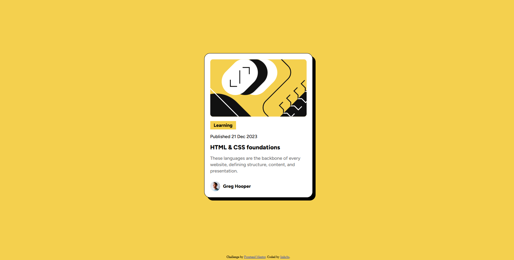

# Frontend Mentor - Blog preview card solution

This is a solution to the [Blog preview card challenge on Frontend Mentor](https://www.frontendmentor.io/challenges/blog-preview-card-ckPaj01IcS). Frontend Mentor challenges help you improve your coding skills by building realistic projects. 

## Overview

### The challenge

Users should be able to:

- See hover and focus states for all interactive elements on the page

### Screenshot

### Links

[Preview](https://linhcbs.github.io/Frontend-Mentor-solutions/blog-preview-card-main)

## My process

### Built with

- HTML5
- CSS3

### What I learned

- The CSS `box-shadow` property (seriously, this time).
- Using `Flexbox` is better than manually setting `margin-bottom` for each component in the card.
- Making components responsive can be simpler without explicitly using `@media screen`.

### Useful resources

- [W3Schools](https://www.w3schools.com/)

## Author

- Frontend Mentor - [@linhcbs](https://www.frontendmentor.io/profile/linhcbs)
