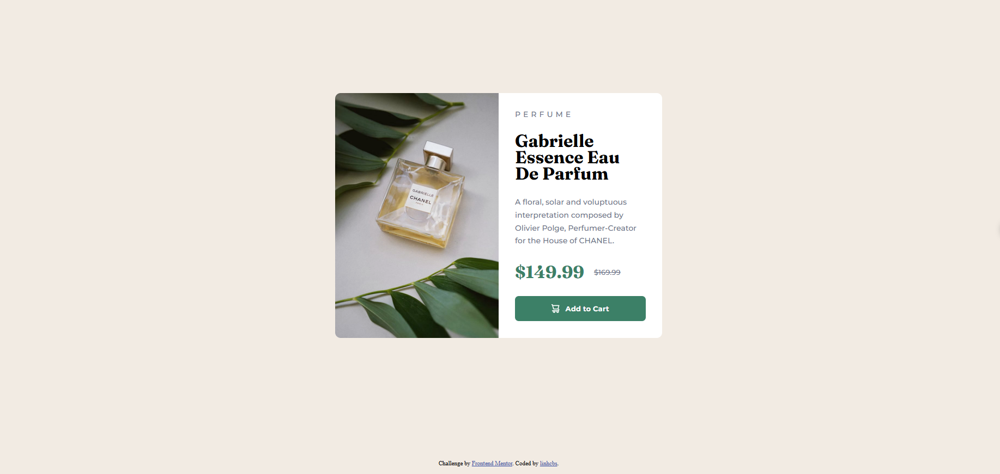

# Frontend Mentor - Product preview card component solution

This is a solution to the [Product preview card component challenge on Frontend Mentor](https://www.frontendmentor.io/challenges/product-preview-card-component-GO7UmttRfa). Frontend Mentor challenges help you improve your coding skills by building realistic projects. 

## Overview

### The challenge

Users should be able to:

- View the optimal layout depending on their device's screen size
- See hover and focus states for interactive elements

### Screenshot

### Links

[Preview](https://linhcbs.github.io/Frontend-Mentor-solutions/product-preview-card-component-main)

## My process

### Built with

- HTML5
- CSS3

### What I learned

- A  way to organize the HTML, group, and name classes more neatly.

### Useful resources

- [W3Schools](https://www.w3schools.com/)

## Author

- Frontend Mentor - [@linhcbs](https://www.frontendmentor.io/profile/linhcbs)
