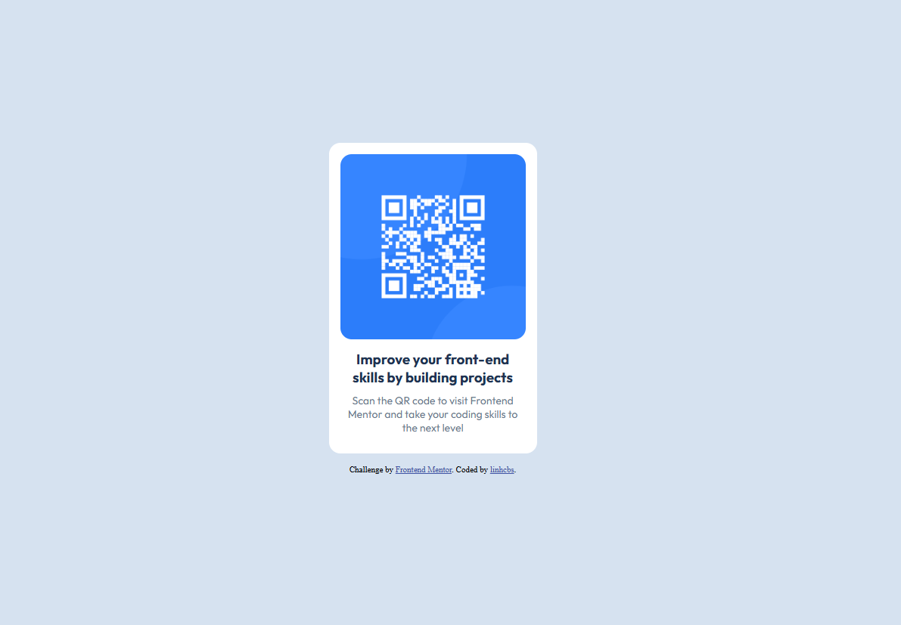

# Frontend Mentor - QR code component solution

This is a solution to the [QR code component challenge on Frontend Mentor](https://www.frontendmentor.io/challenges/qr-code-component-iux_sIO_H). Frontend Mentor challenges help you improve your coding skills by building realistic projects. 

## Try it at
[this solution's github pages](https://linhcbs.github.io/My-Front-end-Dump/qr-code-component-main/)

## Overview

### Screenshot

### Built with

- HTML5
- CSS3

### What I learned

- I learned that I hate coding responsive UI.
