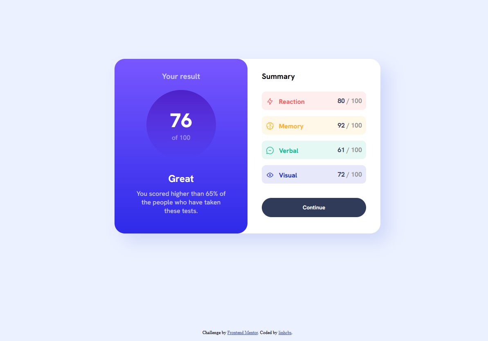

# Frontend Mentor - Recipe page solution

This is a solution to the [Recipe page challenge on Frontend Mentor](https://www.frontendmentor.io/challenges/recipe-page-KiTsR8QQKm). Frontend Mentor challenges help you improve your coding skills by building realistic projects. 

## Overview

### Screenshot

### Links

[Preview](https://linhcbs.github.io/Frontend-Mentor-solutions/results-summary-component-main)

## My process

### Built with

- HTML5
- CSS3

### What I learned

- How to make gradient background with color.

### Useful resources

- [W3Schools](https://www.w3schools.com/)

## Author

- Frontend Mentor - [@linhcbs](https://www.frontendmentor.io/profile/linhcbs)
