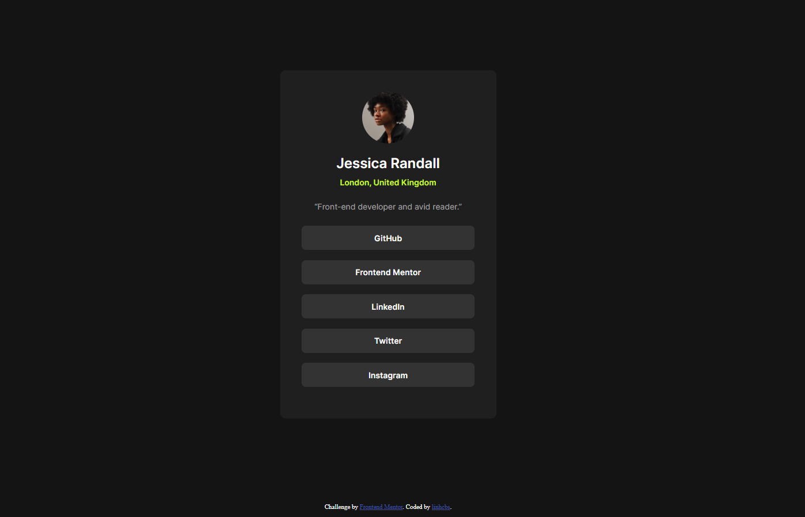

# Frontend Mentor - Social links profile solution

This is a solution to the [Social links profile challenge on Frontend Mentor](https://www.frontendmentor.io/challenges/social-links-profile-UG32l9m6dQ). Frontend Mentor challenges help you improve your coding skills by building realistic projects. 

## Overview

### The challenge

Users should be able to:

- See hover and focus states for all interactive elements on the page

### Screenshot

### Links

- [Preview](https://linhcbs.github.io/Frontend-Mentor-solutions/social-links-profile-main/)

## My process

### Built with

- HTML5
- CSS3

### What I learned

The HTML should be simple enough.

### Useful resources

- [Chat GPT](https://www.chatgpt.com)
- [W3Schools](https://www.w3schools.com/)

## Author

- Frontend Mentor - [@linhcbs](https://www.frontendmentor.io/profile/linhcbs)
